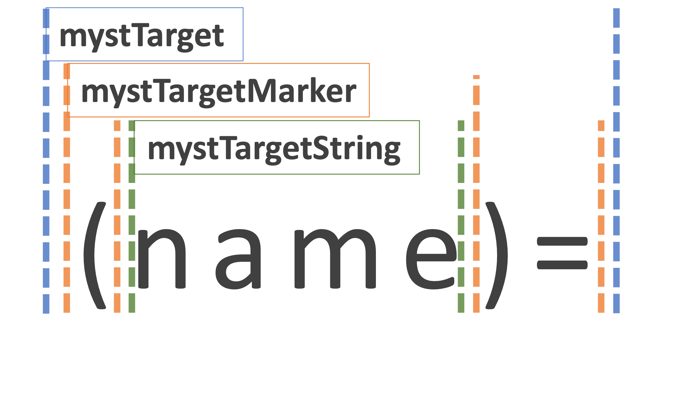

# unified-myst (IN-DEVELOPMENT)

unified-myst is a [monorepo] containing packages for using MyST (Markedly Structured Text), within the [unified] ecosystem.
It is intended to be a reference implementation of [myst-spec](https://github.com/executablebooks/myst-spec).

:::{note}
All packages are [scoped](https://docs.npmjs.com/cli/v8/using-npm/scope) under the `@unified-myst` namespace: <https://www.npmjs.com/org/unified-myst>
:::

## Packages

The dependency graph is as follows:

- [`@unified-myst/core-parse`](./packages/core-parse/README.md)
  - Role and directive processing
    - [`@unified-myst/process-roles-directives`](./packages/process-roles-directives/README.md)
    - [`@unified-myst/nested-parse`](./packages/nested-parse/README.md)
  - Syntax parsing extensions
    - [`@unified-myst/break-extension`](./packages/break-extension/README.md)
    - [`@unified-myst/comment-extension`](./packages/comment-extension/README.md)
    - [`@unified-myst/role-extension`](./packages/role-extension/README.md)
    - [`@unified-myst/target-extension`](./packages/target-extension/README.md)

## core parse

[`@unified-myst/core-parse`](./packages/core-parse/README.md) is detailed more fully in it's readme.

It provides a fully extensible API for parsing MyST to AST.

```javascript
import { Processor } from '@unified-myst/core-parse'
import { admonitionsExtension } from '@unified-myst/core-parse/extensions/admonitions.js'
import { inlineMarkupExtension } from '@unified-myst/core-parse/extensions/inlineMarkup.js'

const parser = new Processor()
    .use(admonitionsExtension)
    .use(inlineMarkupExtension)
const result = parser.toAst('Hello world!')
```

## Syntax parsing extensions

The extensions provide the following features:

- Parsing each syntax of the MyST language, from source text, to [micromark-tokens]
- Directly [compiling HTML](https://github.com/micromark/micromark#compile) from the tokens
- Generating the corresponding [MDAST-nodes] from the tokens, for use with [remark]

Take the target syntax `(name)=`.

The `@unified-myst/target-extension` package provides the `mystTargetMmarkExt`, `mystTargetHtmlExt`, and `mystTargetMdastExt` extensions.

First we can parse the target syntax to [micromark-tokens]:

```javascript
import { parse } from 'micromark/lib/parse'
import { postprocess } from 'micromark/lib/postprocess'
import { preprocess } from 'micromark/lib/preprocess'
import { mystTargetMmarkExt } from '@unified-myst/target-extension'

const options = { extensions: [mystTargetMmarkExt] }
const events = postprocess(
    parse(options).document().write(preprocess()('(name)=', 'utf8', true))
)
console.log(
    events.map((event) => {
        return [
            event[0],
            event[1].type,
            `${event[1].start.line}.${event[1].start.column}`,
            `${event[1].end.line}.${event[1].end.column}`,
        ]
    })
)
// [
//   [ 'enter', 'mystTarget', '1.1', '1.8' ],
//   [ 'enter', 'mystTargetMarker', '1.1', '1.2' ],
//   [ 'exit', 'mystTargetMarker', '1.1', '1.2' ],
//   [ 'enter', 'mystTargetString', '1.2', '1.6' ],
//   [ 'enter', 'data', '1.2', '1.6' ],
//   [ 'exit', 'data', '1.2', '1.6' ],
//   [ 'exit', 'mystTargetString', '1.2', '1.6' ],
//   [ 'enter', 'mystTargetMarker', '1.6', '1.8' ],
//   [ 'exit', 'mystTargetMarker', '1.6', '1.8' ],
//   [ 'exit', 'mystTarget', '1.1', '1.8' ]
// ]
```

Tokens are pointers to slices of the original source text, which can be nested:



These tokens can be compiled directly to HTML:

```javascript
import { micromark } from 'micromark'
import { mystTargetMmarkExt, mystTargetHtmlExt } from '@unified-myst/target-extension'

const options = {
    extensions: [mystTargetMmarkExt],
    htmlExtensions: [mystTargetHtmlExt],
}
console.log(micromark('(name)=', options))
// <a class="anchor" id="name" href="#name">🔗</a>
```

Or be compiled to [MDAST-nodes]:

```javascript
import { fromMarkdown } from 'mdast-util-from-markdown'
import { mystTargetMmarkExt, mystTargetHtmlExt } from '@unified-myst/target-extension'

const options = {
    extensions: [mystTargetMmarkExt],
    mdastExtensions: [mystTargetMdastExt],
}
const mdast = fromMarkdown('(name)=', 'utf8', options)
console.log(JSON.stringify(mdast, null, '  '))
// {
//   "type": "root",
//   "children": [
//     {
//       "type": "target",
//       "position": {
//         "start": {
//           "line": 1,
//           "column": 1,
//           "offset": 0
//         },
//         "end": {
//           "line": 1,
//           "column": 8,
//           "offset": 7
//         }
//       },
//       "label": "name"
//     }
//   ],
//   "position": {
//     "start": {
//       "line": 1,
//       "column": 1,
//       "offset": 0
//     },
//     "end": {
//       "line": 1,
//       "column": 8,
//       "offset": 7
//     }
//   }
// }
```

## Development

The repository is a [monorepo], with shared resources and dependencies.
To manage the packages and run script commands against one or more packages, it is advised to use [lerna](https://lerna.js.org),
or using the [npm workspace commands](https://docs.npmjs.com/cli/v7/using-npm/workspaces).

The repository is currently typed using [JSDoc](https://www.typescriptlang.org/docs/handbook/jsdoc-supported-types.html), as opposed to [TypeScript](https://www.typescriptlang.org/).
This decision was made, primarily because core packages in the [unified] ecosystem are also typed in this way, and also just because I wanted to try it out.
See [this post](https://blog.logrocket.com/typescript-vs-jsdoc-javascript/) for a brief comparison.
The repository may be converted to TypeScript in the future, but for now it is quite helpful for development, to not require a compilation step.

The repository is formatted with [prettier], linted with [eslint], and unit tested using [Jest](https://jestjs.io/).
There are a number of JavaScript unit testing frameworks (see [this comparison](https://raygun.com/blog/javascript-unit-testing-frameworks/), but jest was chosen because of it is easy to setup/use, flexible, and well used in large projects.
See [this guide](https://jestjs.io/docs/ecmascript-modules) for steps required for  ECMAScript Modules (ESM) support.
[Snapshot Testing](https://jestjs.io/docs/snapshot-testing) is also used extensively; to update snapshots, run `lerna run test -- -- -u` or `npm run -ws test -- -u`.

[rollup.js](https://rollupjs.org/guide/en/) is used for package bundling.
Note that most packages in the [unified] ecosystem are [ESM only](https://gist.github.com/sindresorhus/a39789f98801d908bbc7ff3ecc99d99c)

To release new versions of the packages, run `lerna publish`.

[unified]: https://unifiedjs.com/
[remark]: https://github.com/remarkjs/remark
[micromark-tokens]: https://github.com/micromark/micromark#parse
[MDAST-nodes]: https://github.com/syntax-tree/mdast#nodes
[monorepo]: https://blog.npmjs.org/post/186494959890/monorepos-and-npm.html
[eslint]: https://eslint.org/
[prettier]: https://prettier.io
